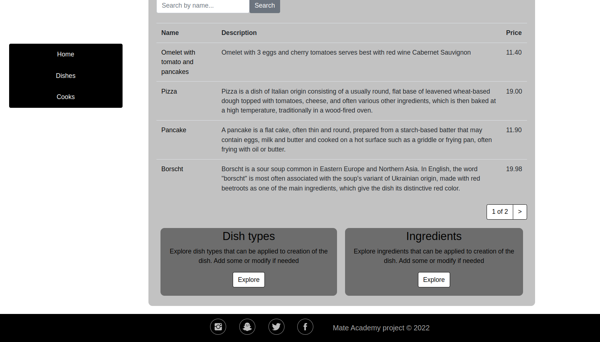

# Restaurant project

Web framework to maintain workflow on the kitchen.
 You may build your own dish with available ingredients and 
 also add some if you need previously registered as a user.


## Installation

Python3 must be already installed

```bash
  git clone "SSH for current repository"
  cd restaurant_project
  python3 -m venv venv
  source venv/bin/activate
  pip install requirements.txt
  python manage.py runserver
```

## Features

- Assign user to dish excecution
- Registration of user from login page
- Search field

    
## Screenshots



